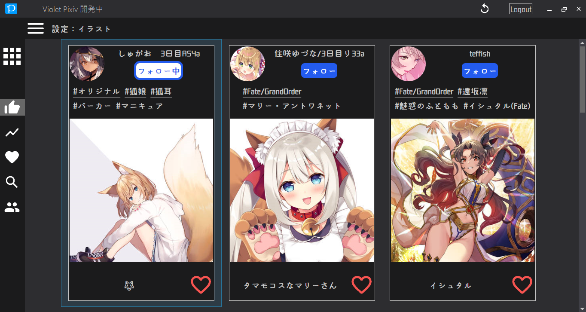
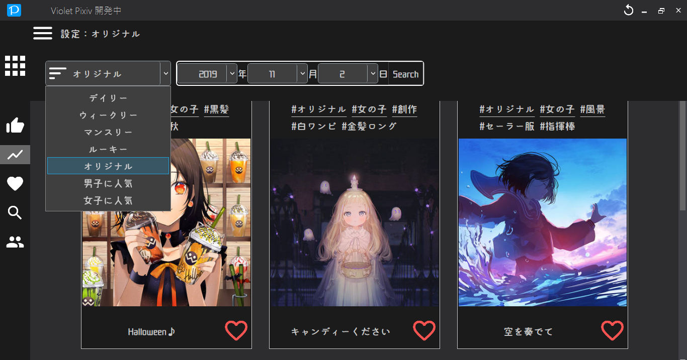
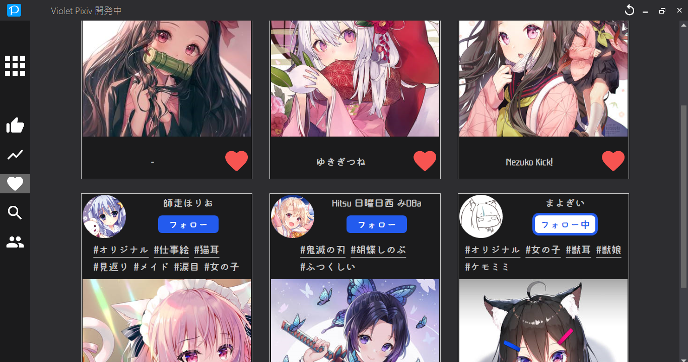
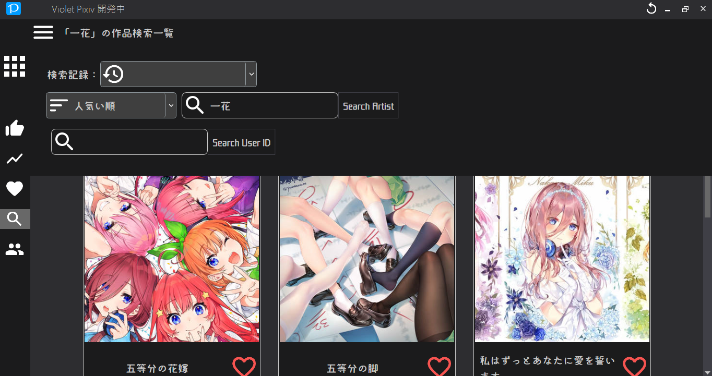
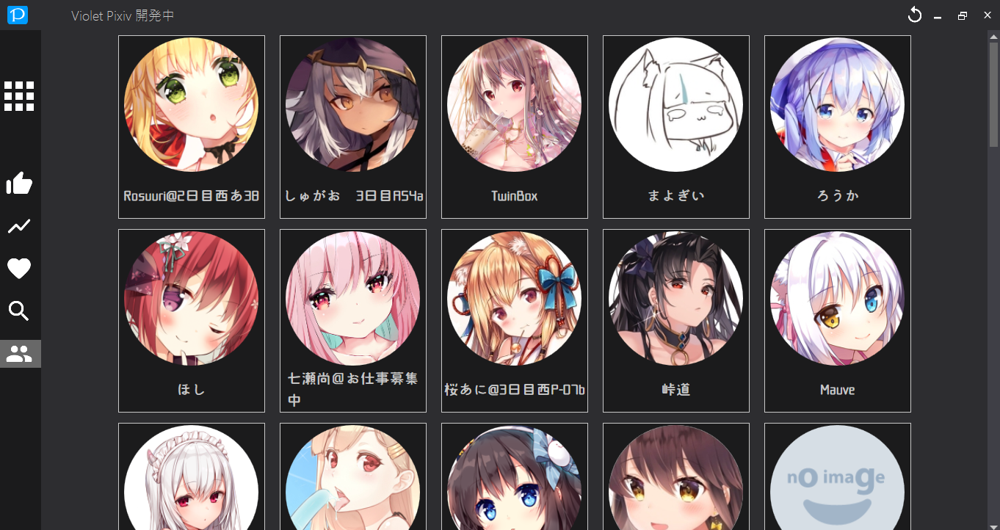
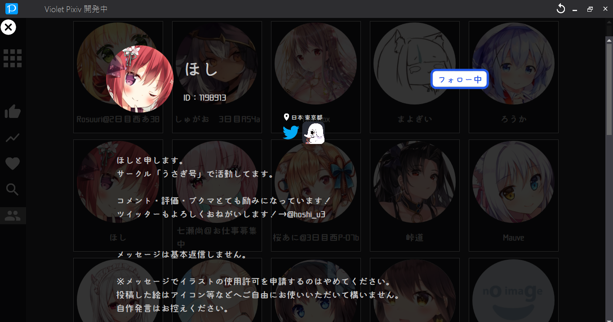
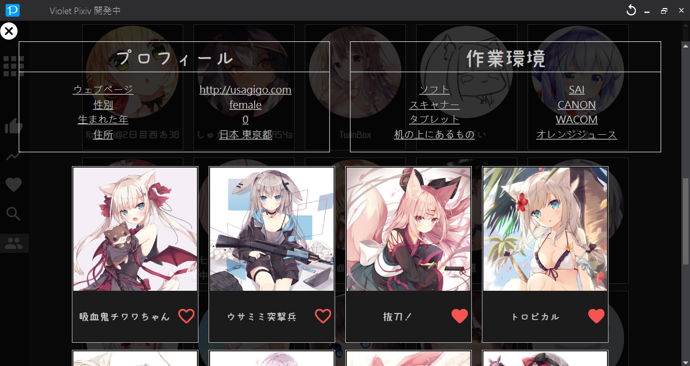
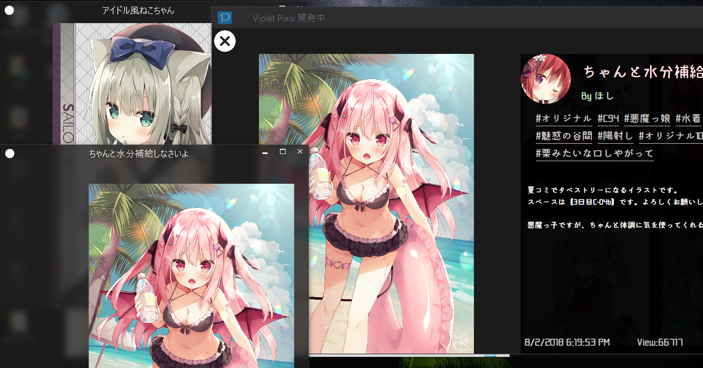
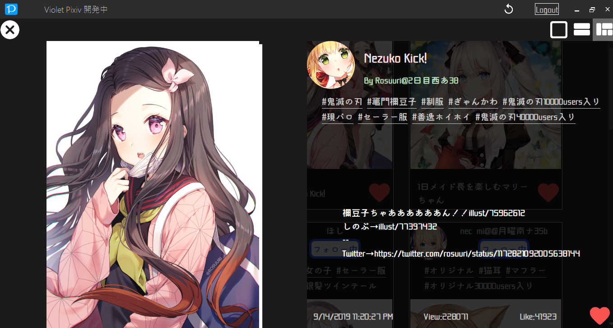
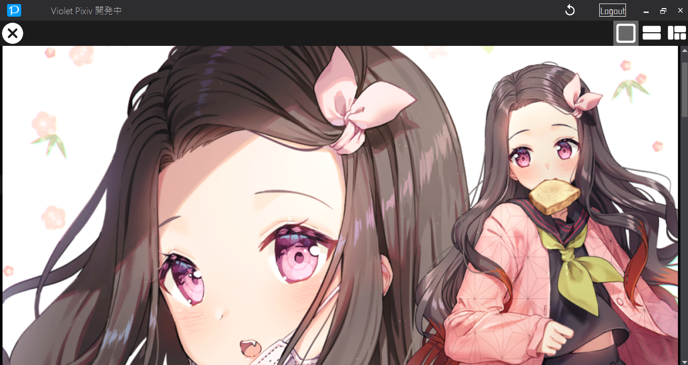

# VioletPixiv (ヴァイオレットピクシブ)

これは自分練習用のプロジェクです。初めてC#で　.NET アプリを開発する。

C# 難しいですねー、日本語も。

## VioletPixivとは？

Pixivの非公式なAPIを使う、そして、WPFプロジェクトでAPIデータと連携し、デスクトップインターフェースを実現する。

要するに、Desktop PIXIVです。

Violetの霊感は、アニメ動画 ヴァイオレット・エヴァーガーデン から出ました。
そして、VioletPixiv　この名前誕生した。
「愛してるの意味を知りたいのです」← このセリフが私を感動させた！

## 言語

C# ← WPF

## 動作環境

OS：Windowsのみです。Windows 10 推奨します。

.NET Framwork：.NET Framwork 4.7

## 機能リスト

- [x] 基本ログイン機能
- [x] ログアウト機能
- [x] 既存API拡張 ([Pixeez](https://github.com/cucmberium/Pixeez))
- [x] ユーザーフォロー機能
- [x] 作品 ♡ 機能
- [x] おすすめ作品一覧表示
- [X] Ranking作品一覧表示
- [x] 作品 ♡ 一覧表示
- [x] フォローユーザー一覧表示
- [X] 作品検索機能
- [X] タグ検索機能
- [X] 作品ダウンロード機能
- [ ] 自分のアカウント状態
- [X] 他のユーザーのアカウント状態
- [x] イラストズームイン
- [x] イラストウインドウ
- [ ] ユーザー設定

## デモ

## 感謝リスト

### [Pixeez](https://github.com/cucmberium/Pixeez)

    The MIT License (MIT) 

    Copyright (c) 2016 cucmberium

**リンク：** [Pixeez/LICENSE.txt](Pixeez/LICENSE.txt)

C# PIXIV ライブラリを提供する。

### [MetroRadiance](https://github.com/Grabacr07/MetroRadiance)

    The MIT License (MIT)

    Copyright (c) 2014 Manato KAMEYA

**リンク：** [LICENSE.txt](https://github.com/Grabacr07/MetroRadiance/blob/develop/LICENSE.txt)

WPFフロントエンドテーマを提供し、カスタムのことができるようになります。

### [pixivpy](https://github.com/upbit/pixivpy)

Sniffer データを參考にする。

